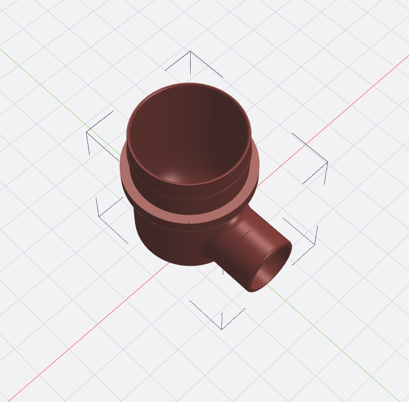

# Aircon Drain Tube Adapter for Vacuum Cleaner

A simple adapter that fits to the end of a wet vacuum cleaner to allow you to remove sludge and water from aircon drain tubes.

This is designed to fit the Karcher WD1 Wet/Dry vacuum Cleaner hose, however it will also fit any wet / dry vacuum cleaner with a 32mm inside diameter hose.

The adapter is simply fitted onto the vacuum hose and the other end inserted into the drain end of the aircon drain tube.

In Singapore, the outlet is normally located in the floor drain of the nearest wet area, i.e kitchen or bathroom.

The aircon drain tubes are generally 19mm inside diameter.

## Aircon Drain Vacuum Hose Adapter Rendering

## Karcher W1 Wet/Dry Vacuum

## Karcher W1 Hose

## Aircon Drain Adapter Fitted

---
Shield: [![CC BY 4.0][cc-by-shield]][cc-by]

This work is licensed under a
[Creative Commons Attribution 4.0 International License][cc-by].

[![CC BY 4.0][cc-by-image]][cc-by]

[cc-by]: http://creativecommons.org/licenses/by/4.0/
[cc-by-image]: https://i.creativecommons.org/l/by/4.0/88x31.png
[cc-by-shield]: https://img.shields.io/badge/License-CC%20BY%204.0-lightgrey.svg
