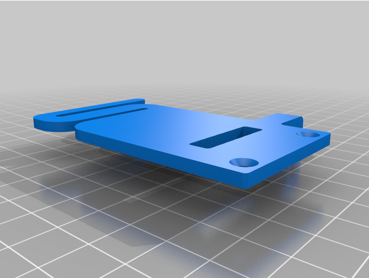

A simple strain relief for the CR6.

This screws to the Print Head Ribbon Cable Connector using M3 x 8 countersink screws.

It supports the ribbon cable as well as keeping the Boden tube vertical where it enters the retainer.

