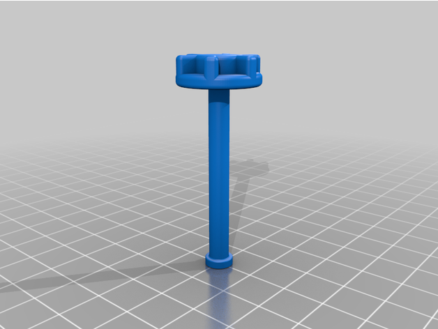

I remove the hot-end cover on the CR6 quite often and wanted a faster way of securing and removing the cover.

A M3 x 16 screw nut is required, screw it into the threaded end, cut off the head and file around the end to remove burrs.

