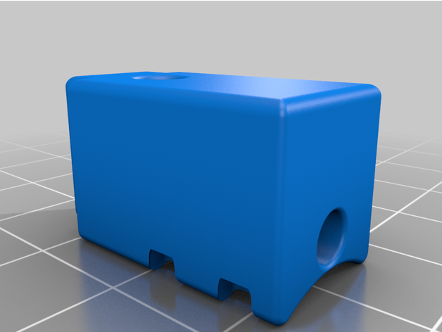
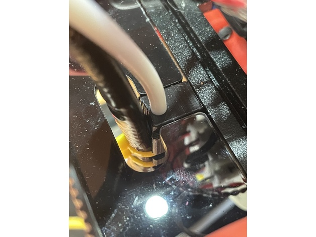

Voron 0.1 Cable & Bowden Strain Relief
==

This adds a 4mm diameter hole to accept the bowden tube and provide strain relief for both the cables and the PTFE tube going to the print head.

Current version has the following changes:

1) makes the cable tie slots wider
2) pushes out the cable-side face by 2mm
3) makes the 4mm bowden tube hole enclosed.

---
Shield: [![CC BY 4.0][cc-by-shield]][cc-by]

This work is licensed under a
[Creative Commons Attribution 4.0 International License][cc-by].

[![CC BY 4.0][cc-by-image]][cc-by]

[cc-by]: http://creativecommons.org/licenses/by/4.0/
[cc-by-image]: https://i.creativecommons.org/l/by/4.0/88x31.png
[cc-by-shield]: https://img.shields.io/badge/License-CC%20BY%204.0-lightgrey.svg