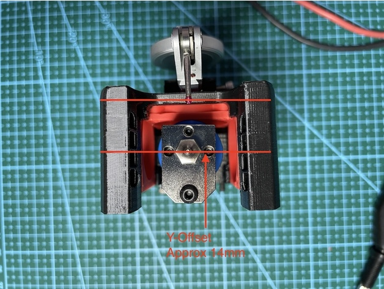
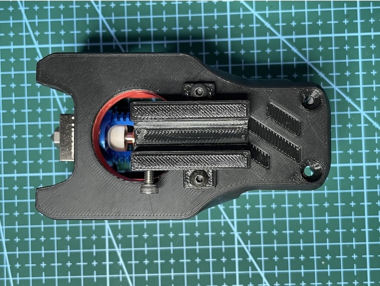
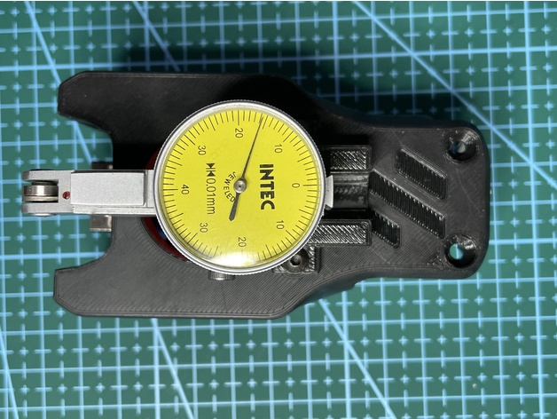
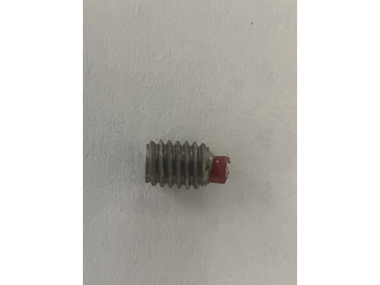

Dial Indicator Mount for the Voron 0.1
==

The idea here was to get as close to the nozzle as possible, in this case it is roughly 14mm Y offset from the nozzle.

I used the m3 grub screws with nylon inserts (see the image) to prevent scratching the body of the dial indicator, although in the main picture a cap head M3 screw is shown.

The indicator 'mitre' joint might be a bit tight initially, you need to slide it up and down until it moves smoothly.

After mounting it to the head with 2x M3 x 40 screws, you can adjust the angle of the probe and slide up/down to adjust the height so that it's just below the nozzle height.

I then created 1/2 dozen macros to move to the bed-screws position using the Y 14mm offset, I have not tested yet but probably the BED_SCREWS_ADJUST can be used by modifying the coordinates to allow for the 14mm Y offset.

It worked great for me, I was able to get pretty much zero error at the 3 points, however the magnetic bed is not flat and it would also be possible to do a manual bed mesh using this setup, but I have not got around to that yet.

---
Shield: [![CC BY 4.0][cc-by-shield]][cc-by]

This work is licensed under a
[Creative Commons Attribution 4.0 International License][cc-by].

[![CC BY 4.0][cc-by-image]][cc-by]

[cc-by]: http://creativecommons.org/licenses/by/4.0/
[cc-by-image]: https://i.creativecommons.org/l/by/4.0/88x31.png
[cc-by-shield]: https://img.shields.io/badge/License-CC%20BY%204.0-lightgrey.svg