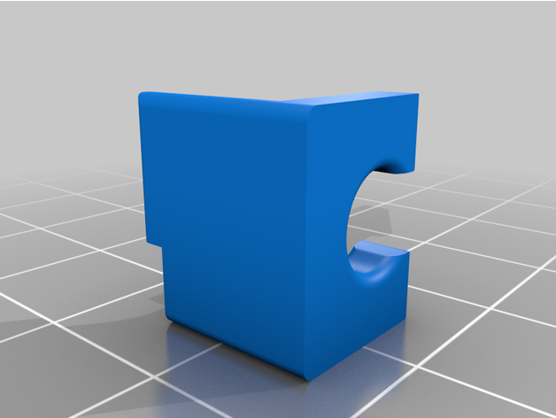
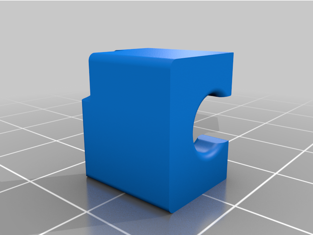
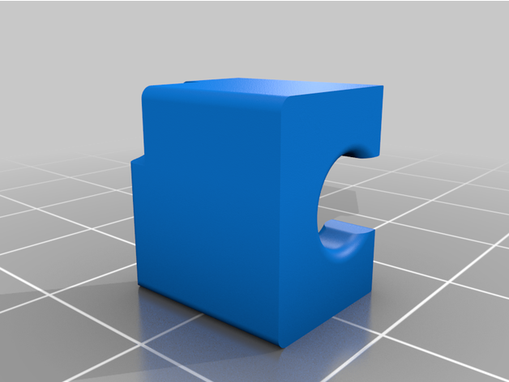

# Voron 0.1 Magnetic Bed Guides

A simple clip-on magnetic bed alignment solution for the Voron 0/0.1.

I always seem to fiddle about trying to get the magnetic bed to align with the magnet, and designed this solution.

It simply clips over the M3 Locknuts on the underside of the bed and slides in from the side.

Should also work on the original Voron 0.

Added version 2 which is 0.5mm longer and makes it much easier to locate the magnetic bed.

## Installed
bed-guide-v2.jpg

## Bed Alignment Left V1 - Rendered

## Bed Alignment Left V2 - Rendered

## Bed Alignment Right V1 - Rendered

## Bed Alignment Right V2 - Rendered

---
Shield: [![CC BY 4.0][cc-by-shield]][cc-by]

This work is licensed under a
[Creative Commons Attribution 4.0 International License][cc-by].

[![CC BY 4.0][cc-by-image]][cc-by]

[cc-by]: http://creativecommons.org/licenses/by/4.0/
[cc-by-image]: https://i.creativecommons.org/l/by/4.0/88x31.png
[cc-by-shield]: https://img.shields.io/badge/License-CC%20BY%204.0-lightgrey.svg