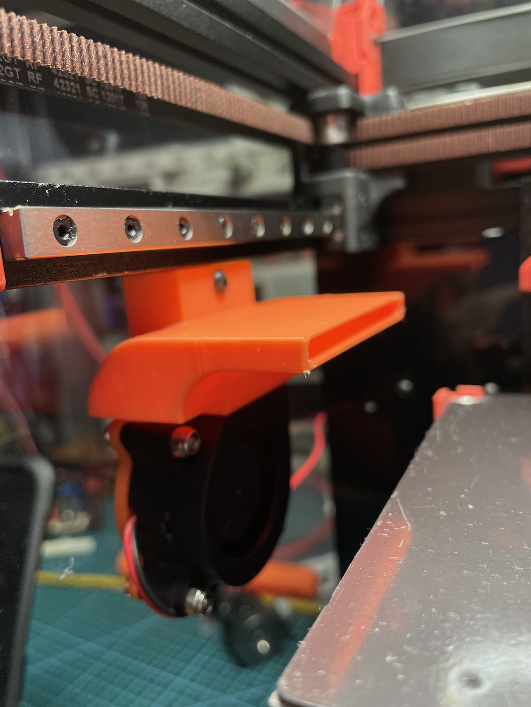

This is a Voron 0.1 enhancement to improve cooling, and especially overhangs.

It uses a 4020 Radial Blower Fan and is 60mm wide.

Ideally you would need two of these each side of the bed to get the best results.

